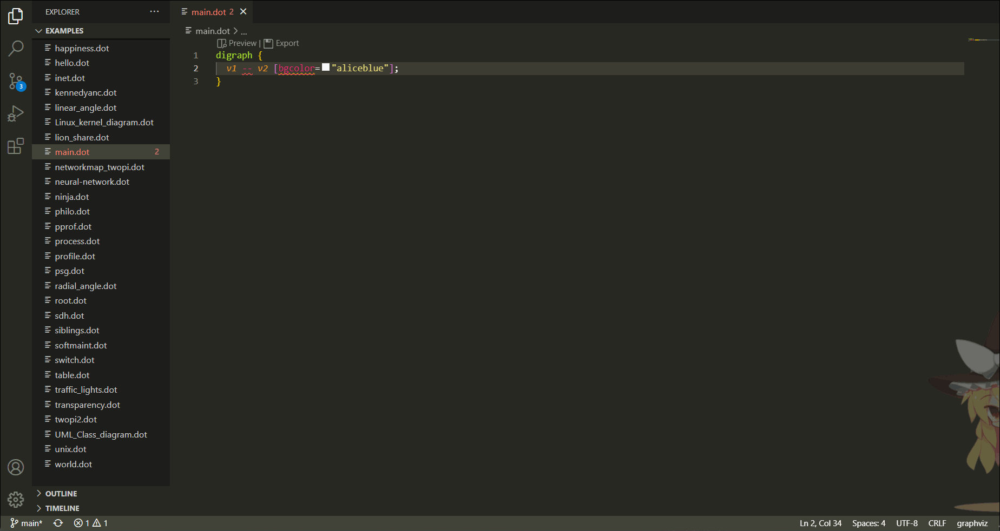
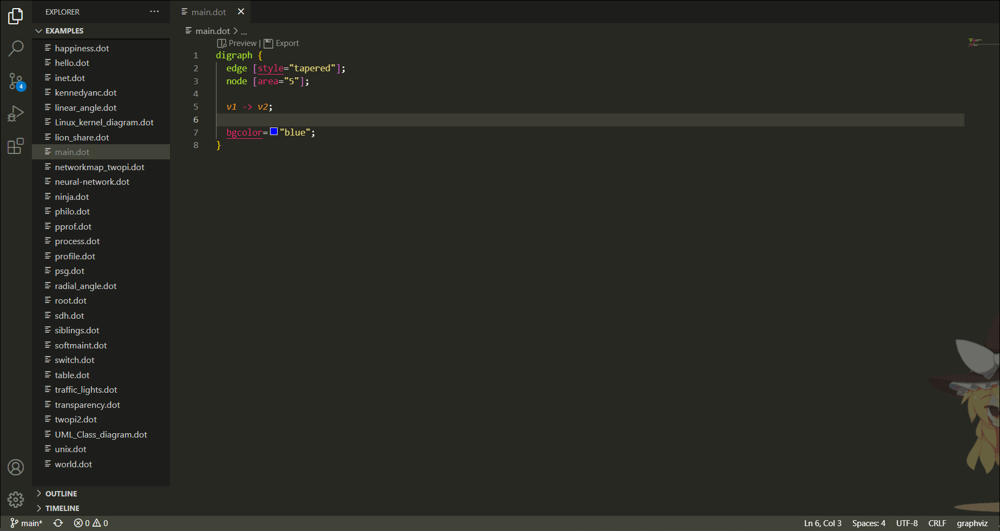
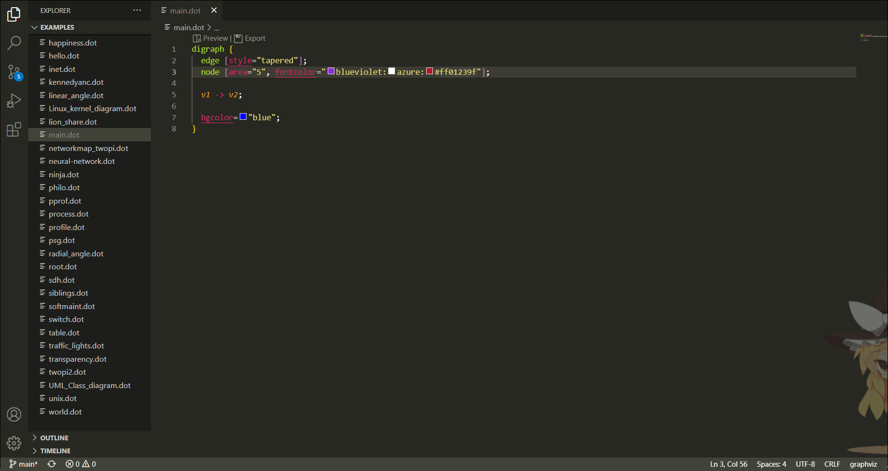
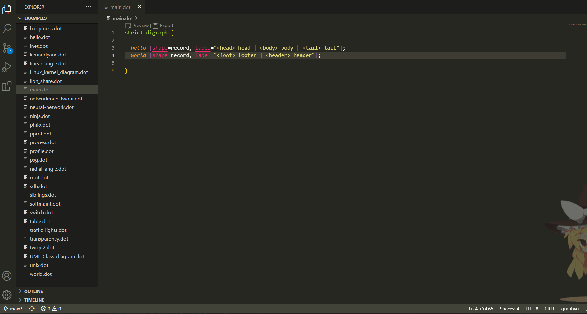
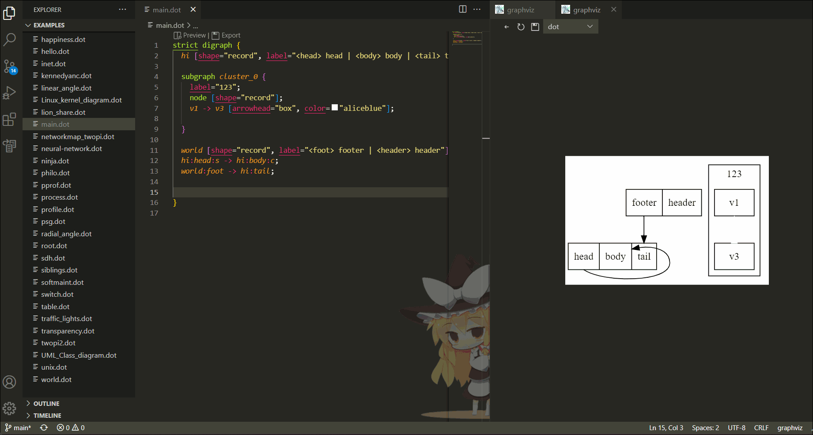
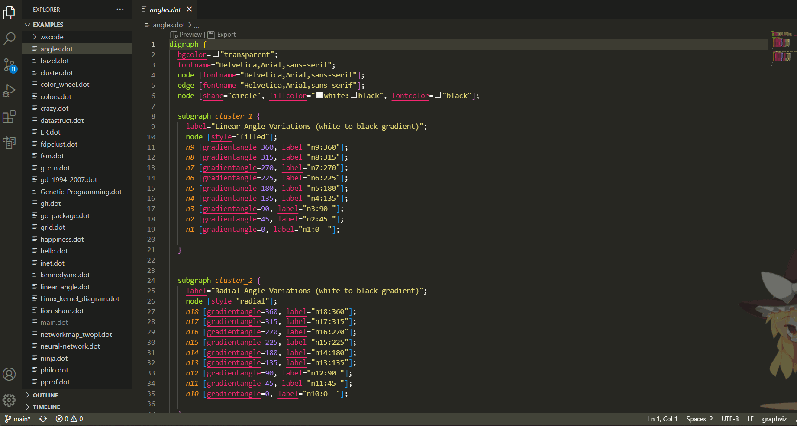

# Graphviz(dot) language supported and preview (Visual Studio Code Extension)
[中文版](README.zh.md)

This plugin provides features such as code highlighting, error prompts, auto-completion, color selection, automatic formatting, find references and rename references for the `dot` language. At the same time, use [viz.js](https://github.com/mdaines/viz.js.git) to preview the code.

## syntax highlighting

## Error message
Here a directed graph `digraph` is defined, but `--` is used to connect the edges, so an `error` is prompted. A non-existing attribute `bgcolor` was used in an edge attribute, thus giving a `warning`.

## Mouse hover prompt
When the mouse hovers over an `attribute`, information about the attribute will be displayed.

## Selection of color
When the mouse moves over the color, a color selection box will appear for selecting a color.

## Autocompletion
This plugin gives autocompletion functionality. Keyword attributes and attribute values can be hinted.

At the same time, you can also prompt for the defined nodes and the [port](https://graphviz.org/doc/info/shapes.html#record-based-note) of the nodes.

## formatting

## Find references, rename nodes

## preview
Click `Preview` in the editor to preview, you can drag the mouse or use the scroll wheel to zoom in and out. Click the drop-down menu above to switch the layout engine.

### Preview multiple files
Set `graphviz.multiPanel` to `true` in `settings.json` to preview multiple files at the same time.

### Preview in the same panel
Set `graphviz.multiPanel` to `false` in `settings.json` to preview in the same `panel`.

### Hot update
Set `graphviz.hotUpdate` to `true` in `settings.json` to enable hot update.

As shown in the figure above, change `bgcolor` to `transparent` in the editor on the left, then save, and the preview interface on the right will be updated synchronously immediately.

## export
Click `Export` in the editor to export.
