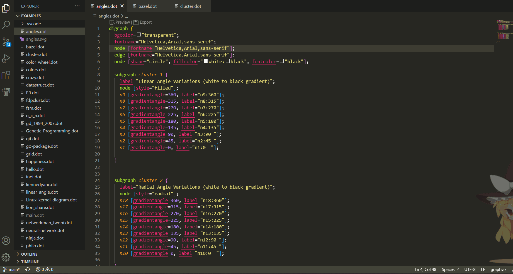

# Graphviz(dot) language supported and preview (Visual Studio Code Extension)

本插件对 `dot` 语言提供代码高亮、错误提示、自动补全、颜色选择、自动格式化、查找引用并重命名引用等特性。同时，使用 [viz.js](https://github.com/mdaines/viz.js.git) 对代码进行预览。

## 语法高亮

## 错误提示
这里定义了一个有向图 `digraph`，但是使用了 `--` 来连接边，因此提示了一个 `error`。在边的属性中使用了一个不存在的属性 `bgcolor`，因此给出了一个 `warning`。

## 鼠标悬浮提示
当鼠标悬浮在 `attribute` 上面时，会显示该属性的相关信息。

## 颜色选择
当鼠标移动到颜色上面是，会出现颜色选择框以供选择颜色。

## 自动补全
该插件给出了自动补全功能。可以对关键字属性和属性值进行提示。

同时还可以对已经定义的节点以及节点的 [port](https://graphviz.org/doc/info/shapes.html#record-based-note) 进行提示。

## 格式化

对于 `1.1.14` 以下的版本有一个小 bug ，格式化功能会删除所有的注释。如果您想要保留注释，请不要使用格式化功能。但是 `1.1.14` 修复了这个 bug。

保留注释的格式化:

## 查找引用、重命名节点

## 预览
点击编辑器中的 `Preview` 即可预览，可以鼠标拖拽也可以使用滚轮放缩。点击上面的下拉菜单可以切换布局引擎。

### 预览多个文件
在 `settings.json` 中将 `graphviz.multiPanel` 设置为 `true`，即可同时预览多个文件。

### 在同一个 panel 中预览
在 `settings.json` 中将 `graphviz.multiPanel` 设置为 `false`，即可在同一个 `panel` 中预览。

### 热更新
在 `settings.json` 中将 `graphviz.hotUpdate` 设置为 `true`，即可热更新。

如上图所示，在左边的编辑器中将 `bgcolor` 修改为 `transparent`，然后保存，右边的预览界面马上同步更新。

## 导出
点击编辑器中的 `Export` 即可导出。

